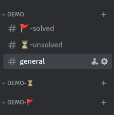
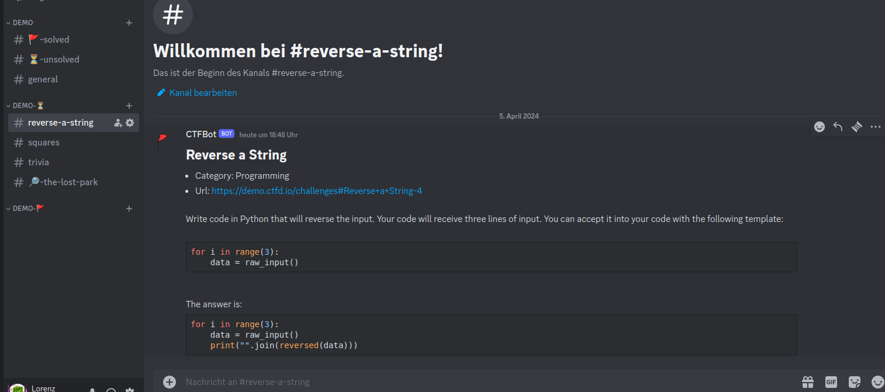
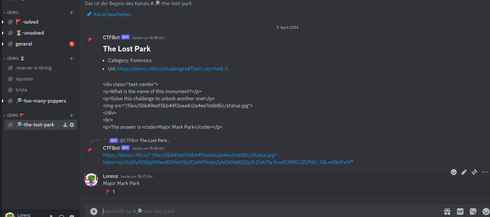

# CTFHelperJava

A Discord bot that helps with `Jeopardy CTF Events`.

## Features
* One CTF per discord server at the same time
* Compatible with `CTFd` and `rCTF` challenge platforms
* Automatically creates discord channels and categories for challenges
* Automatically keeps channels ordered by solved and category
* Automatically submits flags posted in these channels
* Descriptive emojis according to challenge categories
* Automatically synchronizes states with challenge platform (solves outside the bot will lead to a challenge being marked as solved, etc.) 
* Keeps state across crashes and restarts
* Archives messages of all channels associated with a CTF on command
* Deletes all channels and categoryies associated with a CTF on command


## Getting Started
Get started by cloning the github repo.
You will need to create a discord bot in the discord API thingy.
For further details, you can refer to this guide: https://discordpy.readthedocs.io/en/stable/discord.html .
Once the bot is created, but the authentication token into a file called `token.txt`.
This `token.txt` file must be located in the same directory as the bot whenever it is run.

Then, you can use your favorite IDE to build a runnable jar file (using main class `main.Main`) or directly run `main.Main.main` from the IDE.

Once the bot is up and running, you can invite it to your discord server.
Make sure the bot has the necessary permissions to create and edit channels and categories.

Once the bot is added, you can use the following commands:

| command | description |
|---|---|
| `/ctfd-add <name> <endpoint>` | Start a CTF using a CTFd platform located at `<endpoint>`. <br> Prefix newly created channels with `<name>`.|
| `/rctf-add <name> <endpoint>` | Start a CTF using a rCTF platform located at `<endpoint>`. <br> Prefix newly created channels with `<name>`.|
| `/ctf-cookie <name> <value>` | Add a cookie (e.g., session cookie for authorization) |
| `/ctf-header <name> <value>` | Add a header (e.g., Authorization header)|
| `/ctf-pattern <pattern>` | Set regex `<pattern>` to automatically detect flags.|
| `/ctf-update` | Synchronize challenges with challenge platform|
| `/ctf-flag <flag>` | Manually submit flag `<flag>`. <br> Only works in challenge channels.|
| `/ctf-archive` | Save messages of each CTF-related channel to text files.|
| `/ctf-end` | End the current CTF. <br> WARNING: THIS WILL DELETE ALL CHANNELS!!!!|

## Example Usage (on Discord server)

Note: The CTFd demo website resets every now and then.
If the bot fails to update, make sure to refresh your session cookie using `/ctf-cookie`. For actual events, it will usually not be necessary to refresh the cookie after setting it once.

Note: Copy pasting slash commands will probably not work. Start by typing `/` and then let the auto-completion guide your way to success!

First, we add a CTFd event.
For this example, we use the demo hosted at `https://demo.ctfd.io/`:

`/ctfd-add ctfd-demo https://demo.ctfd.io`

Not that we exclude the trailing `/`. 
This is important.
The discord bot should create something similar to this:


To automatically load challenges from the platform, the discord bot needs to be logged in.
For this, we log into the challenge platform in the browser (credentials for demo website: `user`:`password`).
Then, we copy the session cookie and hand it to the discord bot:

`/ctf-cookie session ed1dbe10-acfa-4d5c-8411-196870d50c12.Ct1M5RLPbzaL-dKarKfiSzaeWEw`

The discord bot should now automatically create some channels for challenges and attach challenge description as well as download links for attached files:


This specific demo ctf does not have a flag pattern, but we can set a regex that matches the flag of a challenge:

`/ctf-pattern Major Mark Park`

Now when we write `Major Mark Park` to the `#the-lost-park` channel, it should automatically be submitted:


We can see several things happening here:
1. the message gets reacted to with a flag emoji indicating a valid flag
2. the challenge channel gets moved to the solved category (indicated by the flag)
3. A new challenge (too-many-puppers) was unlocked by solving the challenge. This is automatically detected and the new challenge is added as a channel.
4. A message indicating the challenge was solved is sent and the overview channels for unsolved and solved channels are updated to reflect the solve

Sometimes, individual flags do not match the flag pattern.
In the channel corresponding to the challenge, the flag `for x in range(101): print(x**2)` can be manually submitted by typing the following command into the `#squares` challenge channel:

`/ctf-flag for x in range(101): print(x**2)`

Once the CTF is over, all messages can be archived:

 `/ctf-archive`

 The resulting log files will be written to `archives/<ctf-name>/<channel-name>.log`:
```
archives/
├── demo
│   ├── general.log
│   ├── reverse-a-string.log
│   ├── squares.log
│   ├── the-lost-park.log
│   ├── too-many-puppers.log
│   └── trivia.log
```
While all message text is contained in these logs, uploaded files, reactions, etc. get lost.

Finally, all channels associated with the CTF can be deleted:

`/ctf-end`

Now the discord server is ready to start the next CTF event!

## Source Code Overview

The source code is written in `Java` and located in `src`.
It is not well designed as the goal was getting it working fast and well enough, not perfectly design everything.

The `ctf` package contains generic CTF platform classes.
The implementations for `rCTF` and `CTFd` platforms are located in `ctf.rctf` and `ctf.ctfd` respectively.

The `discord` package contains the discord bot.
`discord.DiscordBot.java` handles generic discord bot things and keeps a mapping from discord servers to CTFs (each server can have only a single CTF at the same time).
There is only one `DiscordBot` instance. <br>
`discord.DiscordBotCTF.java` in contrast describes evertyhing related to a single CTF. Thus, there is one instance of `DiscordBotCTF` per server that has an active CTF.

## Contributing

Feel free to open issues and pull requests for additional features and bug fixes!